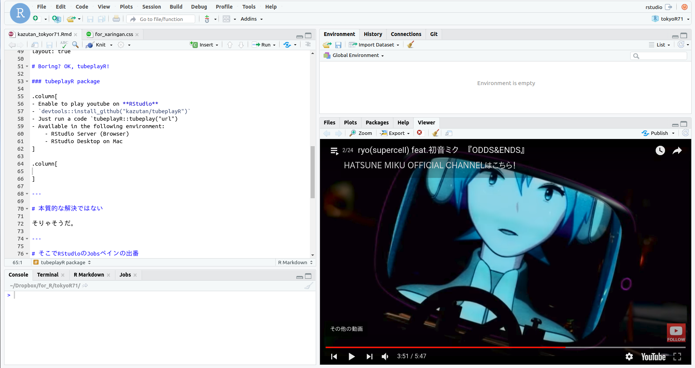
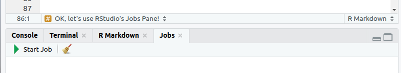
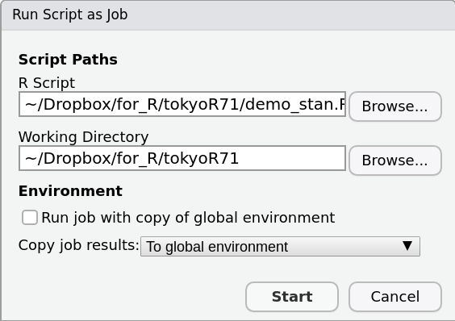
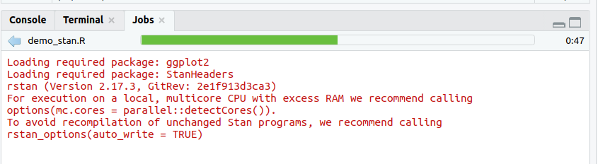
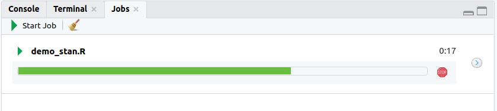

```{r setup, include=FALSE}
options(htmltools.dir.version = FALSE)
```

# my profile

.column[
- Kazuhiro Maeda  
(前田 和寛)
- living in Fukuoka
- @kazutan
    - twitter
    - GitHub
]

.column[


]


---

# What I am struggling to use R...

- In my work, I connect to a database and process large data
- When I run my script, **it takes a lot of time** to get results
  - Other scripts can not be executed during execution
  - Work is not going on, it will cause "Zangyou(残業)"
  - Anyway, I'm really bored while waiting!

.center[
.inline[


]
]

---

# Boring? OK, tubeplayR!

- Enable to play YouTube on **RStudio**
- `devtools::install_github("kazutan/tubeplayR")`
- Just run a code `tubeplayR::tubeplay("url")`
- Available in the following environment:
    - RStudio Server (Browser)
    - RStudio Desktop on Mac

.right[
.inline[

]
]

---

# tubeplayR



---

# But this isn't an essential solution

- Time to process does not change
- And attention is paid to the movie, the work itself may be delayed rather than it
  - In Japanese, "本末転倒"

.center[.font200[What I want is<br/> **"to run the script in parallel"**!]]

---

# OK, let's use RStudio's Jobs Pane!

- New feature of RStudio v1.2
  - Now available in the **Preview version**
  - Search on "rstudio preview" at Web
- When you start the Preview version of RStudio, Jobs Pane is displayed as standard




---

# Procedure to run R Script in parallel

1. Write *.R files
2. activate *.R file tab
2. Click "Start Job" button
3. set R Script file and options
4. start!

.center[.inline[

]
]


---

# processing...done!

.center[
.inline[


]
]

---

# v1.2(stable) will be comming soon...?

- **This is still under development**
  - There is much possibility that specification of function will be changed
  - Also, the behavior of software (including other features) may be unstable
- Let's try RStudio v1.2!
  - There are lots of convenient things besides the features introduced today
  - Please try and feedback!

---

# Enjoy!

### Reference

.font80[
- About RStudio
  - Download: https://www.rstudio.com/products/rstudio/download/
  - Preview: https://www.rstudio.com/products/rstudio/download/preview/
- Slide (make by "xaringan")
  - xaringan(GitHub): https://github.com/yihui/xaringan
- tubeplayR
  - introduction: https://kazutan.github.io/HijiyamaR6/intro_tubeplayR.html#/
  - repository: https://github.com/kazutan/tubeplayR
- Pictures (Copyright © いらすとや)
  - Web site: https://www.irasutoya.com/
- All codes of this presentation
  - GitHub: https://github.com/kazutan/tokyoR71
]

.right[
contact: @kazutan(Twitter)
]


